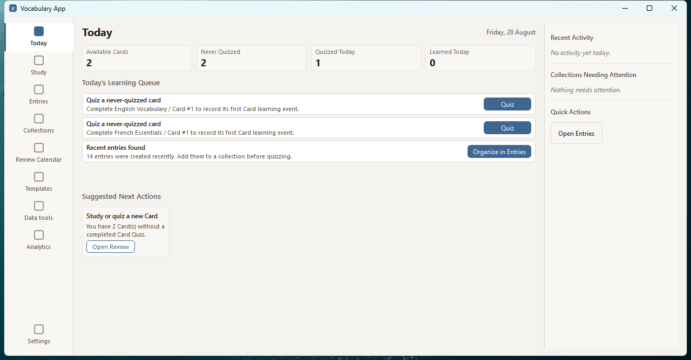
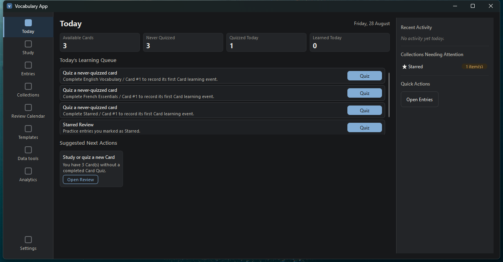
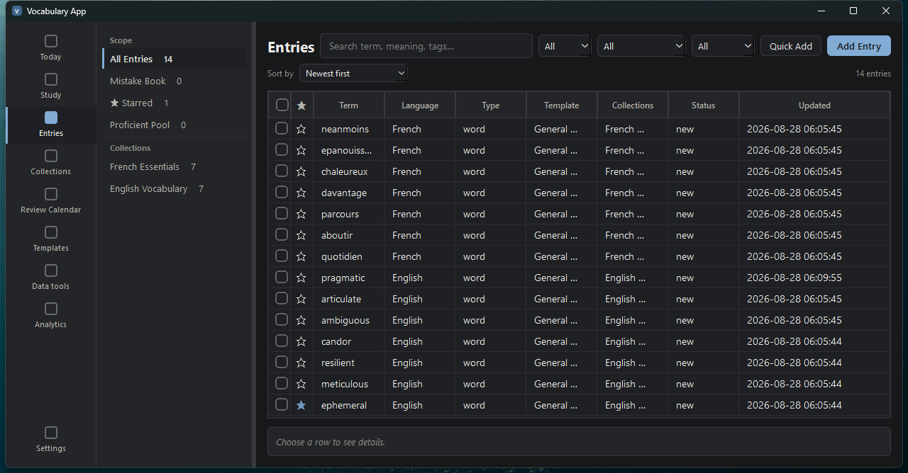
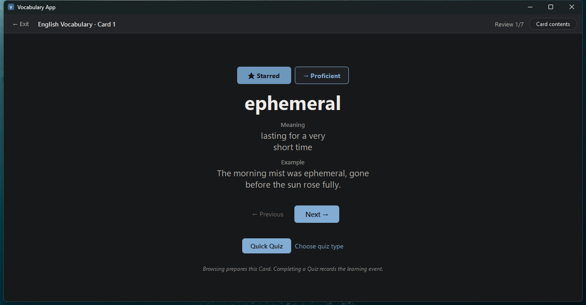
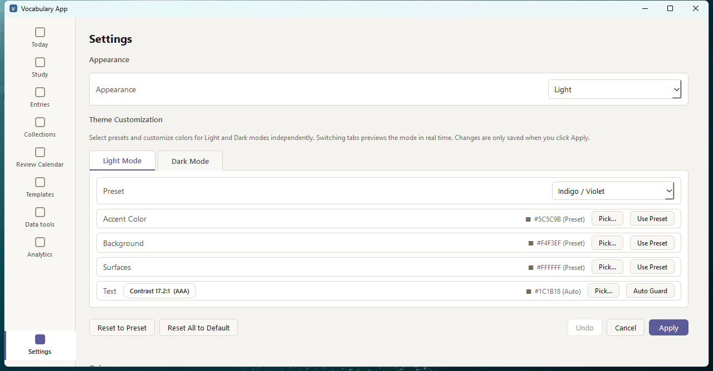

# Vocabulary App

A local-first desktop app for building your own English/French vocabulary into Collections and Cards, then proving what you've actually learned through completed Quizzes — not a "reviewed" checkbox.

Your core learning data (entries, Collections, Quiz history) lives in a local SQLite database on your machine. Preferences, backups, and the optional audio cache are separate local files alongside it. No account, no cloud sync, no bundled dictionaries or third-party pronunciation packs.

[](https://github.com/Peter-S-Shi/vocabulary-app/releases/latest)
[](LICENSE)
[](#download-windows-desktop-app)
[](requirements.txt)

**v1.1.0 is the current public release, published from verified merged `main`.** The native Windows desktop app (PySide6 + SQLite) is the primary product surface; the earlier Streamlit UI remains as a compatibility/reference surface. See [PROJECT_STATUS.md](PROJECT_STATUS.md) for the v1.1 release evidence and the [v1.1.0 GitHub Release](https://github.com/Peter-S-Shi/vocabulary-app/releases/tag/v1.1.0) for the currently published installer and checksum.

## See it

**Today** — the daily home, built from real completed-Quiz history. Appearance is live-switchable between System / Light / Dark from Settings, no restart required:

| Light | Dark |
|---|---|
|  |  |

**Entries** (table-first manager) and **Study** — the compact Star/Proficient actions above each Card are direct, one-click learning-status controls:

| Entries | Study |
|---|---|
|  |  |

**Theme Customization** (Settings) — independent per-mode Accent/Background/Surfaces/Text colors with a guarded-contrast preset (Indigo / Violet shown here), live-previewed before you click Apply:



Screenshots are from the packaged v1.1.0 Windows build, running against a small fictional demo dataset. They cover Today, Entries, Study, and Theme Customization; Collections, Quiz, Review Calendar, Analytics, and the other workspaces aren't pictured here — see [What it does](#what-it-does) below for the full feature list.

## What it does

Vocabulary App is built around your own entries: you create or import your own English/French entries, organize them yourself, and the app keeps an honest local record of what you've actually completed — no pre-built decks, no cloud account, and no opaque scheduling algorithm deciding what you see next.

- **Entries and templates** — create, edit, search, and batch-manage entries; General and custom templates, with built-in French presets; CSV/XLSX import through Upload → Validate → Preview → Confirm.
- **Collections and Cards** — group entries into Collections with configurable Card sizes, reordering, stable Card identity/history, and system pools (Mistake Book, Starred, Proficient Pool).
- **Study and Quiz** — an Immersive Focus Study surface plus self-graded, multiple-choice, and matching Quizzes. Completing a Quiz scoped to a Card is the one authoritative learning event — browsing alone doesn't count, and you don't have to browse first to quiz.
- **Review planning and learning status** — optional next-review scheduling keyed to stable Cards, direct Star actions, honest Collection progress, and consistent Proficient Pool behavior across Study, Quiz, Today, and Review Calendar.
- **Today** — a daily home built from real completed-Quiz history: available Cards, never-quizzed Cards, today's activity, and collections needing attention.
- **Appearance and update awareness** — independent Light/Dark theme customization with guarded contrast, plus a manual/background release check that reports available GitHub releases without downloading or installing them.
- **Analytics** — read-only statistics and learning-trend views computed from actual quiz logs, not estimates.
- **Backup, export, and Card Audio Export** — SQLite backup with non-destructive restore preview, CSV/XLSX export, and Card Audio Export, which renders audio using compatible speech voices already installed on your Windows machine.

## How it works

Reusable learning and data logic lives in framework-independent core modules under `src/`, on top of a local SQLite database. Two UI layers consume that same framework-independent core: a Streamlit compatibility UI (`app.py`, `src/ui_streamlit/`) and the native PySide6 desktop UI (`src/ui_desktop/`), the primary product surface. Application binaries and durable user data are installed to separate locations, and schema upgrades create a safety backup before migrating.

Schema changes are additive-only: an explicit schema/app-metadata version chain has carried real user data through 21 development milestones without a destructive rewrite. See [ARCHITECTURE.md](ARCHITECTURE.md) for the full boundary rules.

## Engineering evidence

- **Enforced architecture boundary** — `scripts/audit_architecture.py` scans `app.py` and `src/` and fails if UI-framework imports (Streamlit or PySide6) leak into core modules, or if either UI layer imports the other.
- **Hosted release gates** — GitHub Actions runs three parallel Release Closure regression shards as an independent release gate (the original single timeout-bounded `unittest discover` job could not complete within the CI time limit and remains available only as a manual `workflow_dispatch` job), then builds the Windows installer and proves a real isolated v1.0.0 → v1.1.0 overlay upgrade with data preservation.
- **Additive migration chain** — schema/app-metadata versioning designed to preserve legacy Review history, Quiz logs, and Card revisions across every milestone rather than resetting user data.
- **Import/export safety** — a transaction-safe Validate → Preview → Confirm pipeline for CSV/XLSX import, read-only exports, and a restore-preview flow that never silently overwrites the active database; existing-database import uses explicit copy-with-backup semantics and never moves or edits the source file.
- **Deliberate no-bundled-TTS decision** — Card Audio Export renders audio using compatible speech voices already installed on Windows, instead of shipping or redistributing a third-party voice model — trading convenience for lower licensing risk (see [Third-Party Notices](THIRD_PARTY_NOTICES.md)).
- **Windows packaging pipeline** — PyInstaller `--onedir` + Inno Setup, Authenticode-signed with a self-signed developer certificate; v1.1 builds include provenance checks, packaged-launch smoke coverage, and isolated upgrade verification (see [PROJECT_STATUS.md](PROJECT_STATUS.md)).

## Download (Windows desktop app)

Download `VocabularyApp-Setup-1.1.0.exe` from the [v1.1.0 GitHub Release](https://github.com/Peter-S-Shi/vocabulary-app/releases/tag/v1.1.0), verify it if you like against the SHA-256 published as `SHA256SUMS.txt` on that release, then run it and launch **Vocabulary App** from the Start Menu. Upgrading from v1.0.0 preserves your existing data; see [PROJECT_STATUS.md](PROJECT_STATUS.md) for the upgrade contract.

The installer is per-user and requires no admin rights. The certificate is a **self-signed developer certificate**, not a publicly trusted one — Windows SmartScreen may show an "unrecognized app" warning on first run; choose "More info" → "Run anyway" if you trust the source. See [M20 Code Signing Setup](docs/packaging/M20_CODE_SIGNING_SETUP.md) for the full rationale.

First launch: **Add Entry** or **Data tools → Import** your first words → group them into a **Collection** → **Study** or **Quiz** the Card. `Today` will start tracking real progress from there.

## Run from source

Useful for development, or to run the still-available Streamlit compatibility UI.

Prerequisites: Python 3.10+, Git optional.

```powershell
git clone https://github.com/Peter-S-Shi/vocabulary-app.git
cd vocabulary-app
python -m venv .venv
.\.venv\Scripts\python.exe -m pip install --upgrade pip
.\.venv\Scripts\python.exe -m pip install -r requirements.txt
```

```bash
git clone https://github.com/Peter-S-Shi/vocabulary-app.git
cd vocabulary-app
python3 -m venv .venv
./.venv/bin/python -m pip install --upgrade pip
./.venv/bin/python -m pip install -r requirements.txt
```

Desktop UI (primary product surface):

```powershell
.\.venv\Scripts\python.exe -m pip install -r requirements-desktop.txt
.\.venv\Scripts\python.exe -m src.ui_desktop
```

Streamlit compatibility UI:

```powershell
.\.venv\Scripts\python.exe -m streamlit run app.py
```

Run both from the directory containing `app.py`. See [Common Errors](#common-errors) below if something doesn't start.

## What this app does not include

- built-in dictionary databases or copyrighted word lists
- bundled pronunciation recordings, TTS voice models, or any third-party TTS runtime
- AI-generated vocabulary explanations, examples, or bulk learning content
- automatic correction of user-created entries
- cloud sync, account login, authentication, or telemetry
- mobile app packaging
- automatic download or installation of software updates
- full destructive database restore

These are current, deliberate product boundaries — see [Content Policy](docs/policies/CONTENT_POLICY.md).

## Local data and privacy

Your core learning data (entries, Collections, Quiz history) lives in a local SQLite database, never uploaded anywhere. It's separate from your preferences, backups, and the optional audio cache, which are their own local files alongside it. This is the same whether you run the packaged Windows build or from source: the default durable data root is a per-user app-data location, not the project checkout. On Windows that's:

```text
%LOCALAPPDATA%\vocabulary_app\vocab.db
%LOCALAPPDATA%\vocabulary_app\backups\
%LOCALAPPDATA%\vocabulary_app\preferences.json
%LOCALAPPDATA%\vocabulary_app\audio-cache\
```

Off Windows it falls back to XDG data-home semantics (`$XDG_DATA_HOME` or `~/.local/share/vocabulary_app`). Application binaries are installed separately from this data root, and uninstalling preserves it by default — destructive removal requires an explicit opt-in. Schema upgrades create a safety backup before migrating, and importing an existing database uses copy-with-backup semantics; the source file is never moved or edited in place. `VOCAB_APP_DB_PATH` is an explicit database-path override for advanced or development use.

See [Data Storage](docs/policies/DATA_STORAGE.md) and [Data Safety](docs/policies/DATA_SAFETY.md) for the full behavior.

## Known limitations

- The release is signed with a self-signed Authenticode certificate (the same `CN=Peter Shi` identity since v1.0), not a publicly trusted one; SmartScreen reputation isn't guaranteed and a warning may appear on first run.
- Full pristine clean-machine VM verification was deferred; v1.0 acceptance used a fresh local standard Windows account instead (see [PROJECT_STATUS.md](PROJECT_STATUS.md)).
- Windows 10/11 x64 only.
- Card Audio Export depends on compatible speech voices already installed on the user's Windows system.
- No automatic updater; update awareness only reports a newer release and opens its page. Upgrades still use a new installer while preserving user data and creating a migration safety backup.

## Documentation

- [docs/README.md](docs/README.md) — full documentation map
- [ARCHITECTURE.md](ARCHITECTURE.md) — layer boundaries and core module responsibilities
- [DESIGN.md](DESIGN.md) — frozen desktop UI design system
- [ROADMAP.md](ROADMAP.md) / [PROJECT_STATUS.md](PROJECT_STATUS.md) — full milestone history and the current release-evidence record (v1.0.0 shipped through M20; v1.1.0 shipped through M21)
- [CONTRIBUTING.md](CONTRIBUTING.md) — project principles and architecture rules for contributors

## Common Errors

**`python` is not recognized** — install Python and add it to `PATH`, then reopen the terminal.

**PowerShell blocks `Activate.ps1`** — activation is optional; every command above calls the virtual-environment Python directly. If you want it anyway: `Set-ExecutionPolicy -Scope Process -ExecutionPolicy Bypass` then `.\.venv\Scripts\Activate.ps1`.

**`streamlit` is not recognized** — use `.\.venv\Scripts\python.exe -m streamlit run app.py`.

**`ModuleNotFoundError: No module named 'src'`** — start the app from the directory containing `app.py`.

**Port 8501 already in use** — `.\.venv\Scripts\python.exe -m streamlit run app.py --server.port 8502`.

## License

[MIT](LICENSE) © 2026 Yunsong Shi (Peter Shi).
